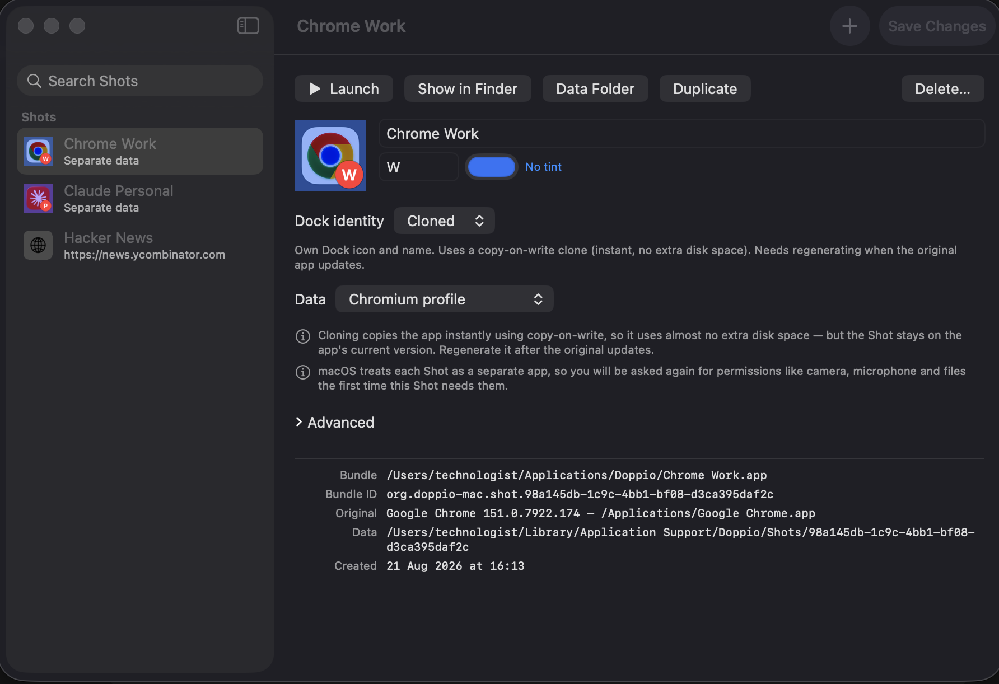
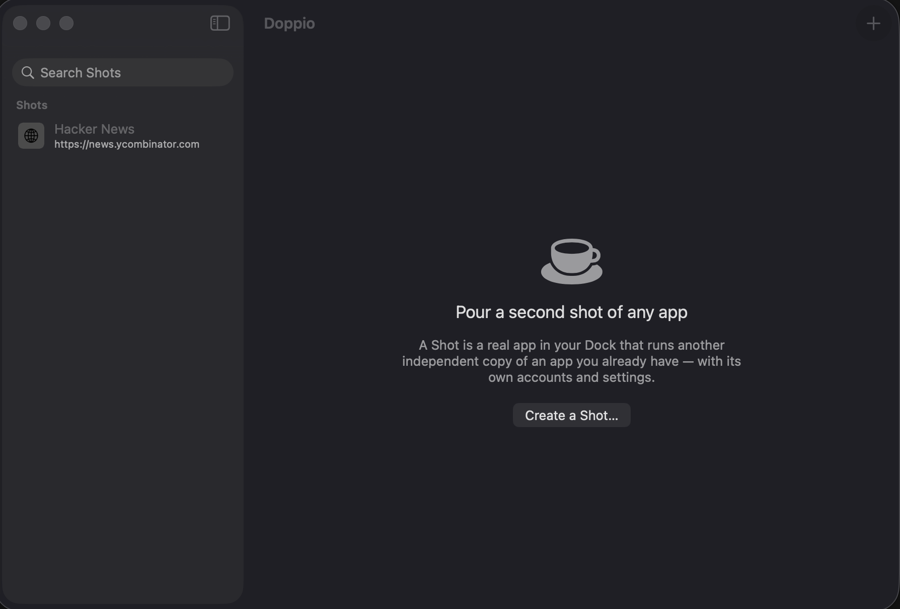

<div align="center">


# Doppio

### Pour a second shot of any app

**Two Slacks. Three Chromes. Four Claudes.**
All at once, all signed into different accounts, all with their own Dock icons.

[](https://github.com/awaistechnologist/doppio/actions/workflows/ci.yml)
[](LICENSE)
[](#platform-coverage)
[](https://github.com/awaistechnologist/doppio/releases/latest)



</div>

---

## The problem

You have a work Slack and a personal Slack. A client's Google account and your
own. Two Claude logins, one for each company.

macOS says: pick one. Sign out, sign back in, repeat forever. Apps are
singletons — one copy, one set of credentials, one Dock icon.

## What Doppio does

Doppio makes a **Shot**: a real application in your Dock, with its own icon, its
own name, and its own accounts. Not a profile switcher. Not a second window.
macOS genuinely believes it is a different app — separate Dock tile, separate
⌘-Tab entry, separate permissions, separate everything.

<div align="center">

</div>

Point it at an app you already have. Ten seconds later there is a second one:

```bash
doppio create --app "Slack" --name "Slack Work" --badge W --tint "#3B82F6"
```

Your original apps are **never modified**. Nothing runs in the background. There
is no telemetry, and Doppio makes no network calls at all.

## What you get

| | |
|---|---|
| ☕ **Its own Dock icon** | Badge it with a letter, tint it, pin it. Cmd-Tab sees a separate app. |
| 🔑 **Its own accounts** | Separate profile, cookies and logins. Work Slack and personal Slack, side by side. |
| 🌐 **Websites as apps** | Turn any URL into a Dock app using the system WebKit engine — no bundled browser. |
| 📄 **Documents as apps** | Put a specific file in your Dock, opened by the app you choose. |
| 💨 **Disposable Shots** | Ephemeral mode erases the Shot's data the moment you quit it. |
| 🧪 **Proof it works** | `doppio verify` launches the Shot and checks it really runs, in isolation, without touching your original app. |
| 🖥 **A real CLI** | Every feature scriptable, everything with `--json`. |
| 🧹 **A real uninstaller** | Shows every file and its size before removing anything. |

## Download

Grab the `.dmg` from the [**latest release**](https://github.com/awaistechnologist/doppio/releases/latest),
open it, and drag Doppio to Applications.

> Releases are **ad-hoc signed, not notarised**, so macOS will refuse the first
> launch. Right-click the app → **Open** → **Open**. Once only. Building from
> source avoids this entirely, because locally built apps are never quarantined.

Or build it yourself — needs the Apple Command Line Tools, **no Xcode**:

```bash
git clone https://github.com/awaistechnologist/doppio.git
cd doppio && ./scripts/build-app.sh --install
open ~/Applications/Doppio.app
```

## Does it actually work? Ask it

Most tools in this space ask you to trust them. Doppio ships the check:

```console
$ doppio verify "Claude Personal"

Claude Personal  [clone, electron]
  ✓ bundle exists  — /Users/you/Applications/Doppio/Claude Personal.app
  ✓ signature valid
  ✓ Doppio provenance
  ✓ launcher present
  ✓ launch plan  — Claude
  ✓ original app intact  — Claude 1.34493.1
  ✓ launcher up to date  — 0.5.0
  ✓ clone up to date  — 1.34493.1
  ✓ launches  — 2 process(es)
  ✓ own identity  — Claude Personal — org.doppio-mac.shot.66571c21-4158-49a0…
  ✓ stays running
  ✓ helper processes  — 6 running
  ✓ isolated data  — 31 entries in the Shot's data folder
  ✓ no crashes

1 Shot(s) verified — all checks passed.
```

It launches the Shot, waits for it to settle, confirms it is *still alive* a
moment later, counts its helper processes, checks the data landed in the Shot's
own folder, confirms **your original app's signature is still valid**, and quits
it again.

That last check exists because an early version of Doppio wrote a file inside
`Claude.app` and broke its signature. It cannot happen twice without something
failing loudly.

## The interesting part: the plan was wrong

The design said — make a wrapper app, have it `exec` the real binary, and macOS
will treat the wrapper as the application. Reasonable. Widely repeated.
**False.**

```console
$ lsappinfo info -only bundleid,name -pid <the new instance>
"CFBundleIdentifier"="com.google.Chrome"     # not the wrapper
"LSDisplayName"="Google Chrome"              # not our name
```

Identity follows the **executable path**, not the bundle that launched it. The
binary has to run from *inside* the Shot — which is why a Shot is a
copy-on-write clone: instant, and near-zero disk because APFS shares the blocks
until something is written.

Getting there meant learning four things the hard way, each from a specific
crash:

| Rule | What breaks otherwise |
|---|---|
| Don't rename the target binary | Chromium reads `_NSGetExecutablePath` and aborts in `main()` |
| Keep `CFBundleName` verbatim | Electron: *"Unable to find helper app"* |
| Inherit the whole `Info.plist` | Electron: *"Failed to get integrity for validatable asar archive"* |
| Set signing flags, don't preserve them | Chrome's `library-validation` flag outranks the entitlement that disables it |

Every measurement, including the negative results, is in
**[docs/mechanism.md](docs/mechanism.md)**. Read it before touching
`BundleForge` — several details look arbitrary and are not.

## What actually works

Honesty is the point of this section. **4 of 31 compatibility rules have been
run end to end**, and two of those are negative results.

| Family | Tested with | Result |
|---|---|---|
| Chromium | Google Chrome | ✅ own icon, isolated profile, 9 helpers |
| Electron | Claude | ✅ own icon, separate login, 8 helpers |
| Websites | WKWebView shell | ✅ own icon, own cookies |
| Sandboxed / App Store | WhatsApp | ❌ **not possible** — see below |
| Firefox, `home`, `env` | — | ⚠️ shipped, unverified |

**Sandboxed apps cannot be isolated.** The theory was that a cloned bundle
identifier would get its own container. Tested: no container is created, and the
clone exits within seconds. Those rules now fall back to a plain second instance
and say so, rather than producing a Shot that looks fine and isn't.

#### Platform coverage

| | Builds + tests | Shot verified running |
|---|---|---|
| macOS 26, Apple Silicon | ✅ | ✅ |
| macOS 15 · macOS 14 | ✅ CI | — |
| macOS 13 | — | — |
| Intel | slices build | — |

## Using it

```bash
doppio apps                                  # what can be shot
doppio create --app "Google Chrome" --name "Chrome Work" --badge W
doppio create --url news.ycombinator.com --name "Hacker News"
doppio create --file ~/notes.md --with "Obsidian"
doppio list
doppio verify --all                          # does it all still work?
doppio doctor                                # anything need regenerating?
doppio uninstall --dry-run                   # what removing Doppio would delete
```

Everything takes `--json`.

There are two knobs per Shot, and Doppio picks both from its compatibility
database and tells you what it chose:

- **Dock identity** — `clone` (default: own icon, regenerate after the app
  updates), `link` (own icon, survives updates, but not for Chromium or
  Electron), or `direct` (shares the original's icon, always works).
- **Data** — `chromium`, `electron`, `firefox`, `home`, `env`, or `none`.

## Things to expect

- **Every Shot asks for its own permissions.** Camera, microphone, screen
  recording — macOS sees a separate app, so it prompts separately. That is the
  isolation working, and it reads like a bug.
- **Cloned Shots pin the app's version.** `doppio doctor` notices when the
  original updates; regenerating takes a second.
- **Don't copy Shots between Macs.** They are ad-hoc signed for one machine.
- **Uninstalling is a real feature**, and never touches data you pointed
  somewhere of your own.

## Contributing

The compatibility database is 31 rules over 53 bundle identifiers, and most are
untested. **Verifying one and flipping `verifiedOn` is the single most useful
contribution** — `doppio verify` does nearly all the work. See
[docs/compat-testing.md](docs/compat-testing.md).

## Licence

[PolyForm Noncommercial 1.0.0](LICENSE) — free for personal use, and for
charities, schools and government bodies. **Commercial use requires a paid
licence**: muhammad.awais.tahir@gmail.com.

This is source-available software, not open source.
[NOTICE.md](NOTICE.md) explains the reasoning and the trade-offs.
